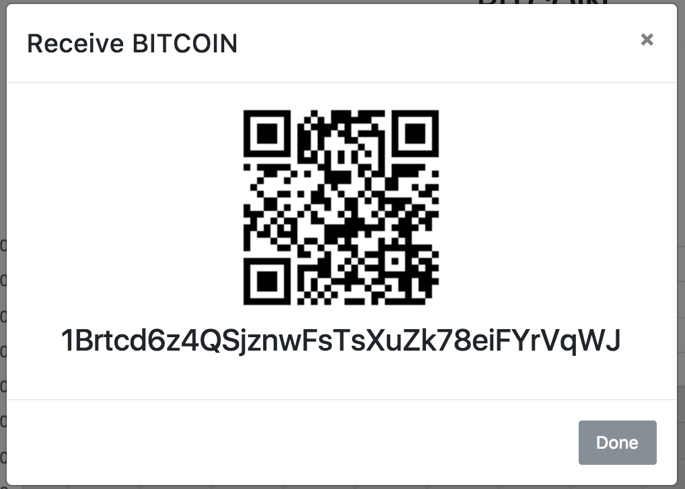

# Ballet (Bitcoin + Wallet) - Electron App

> This is a personal project to learn some new things so I would expect too much

```
git clone .
npm install
npm run dev
```

- ## Live Updating Prices

    

- ## Send

    

- ## Receive

    
